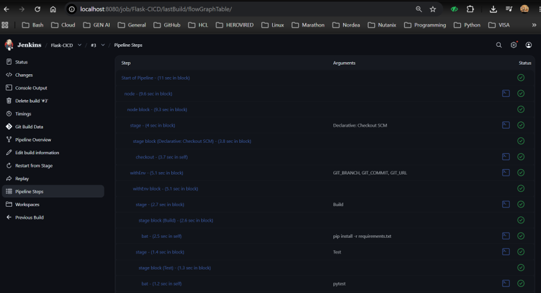
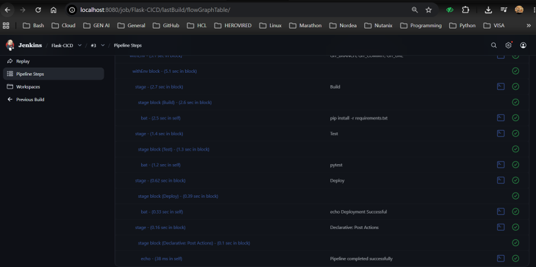
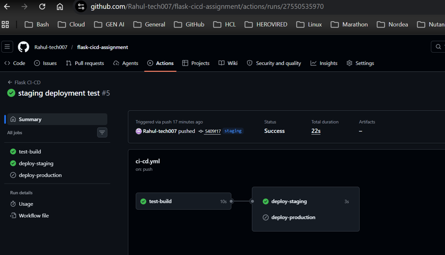
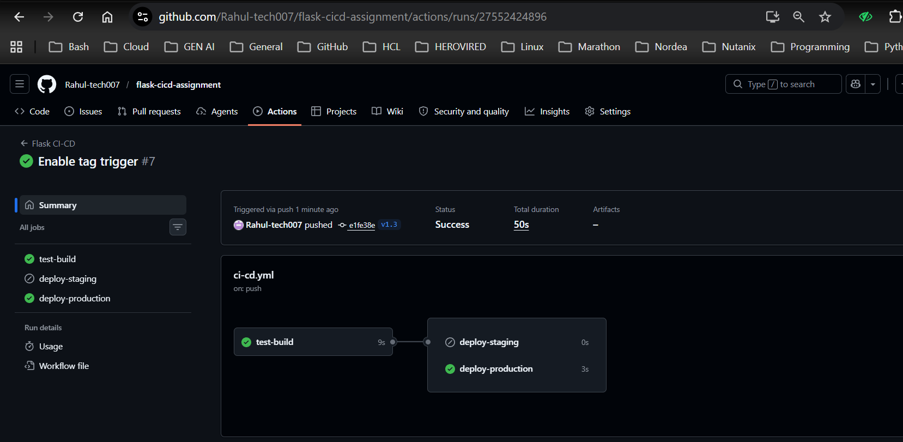
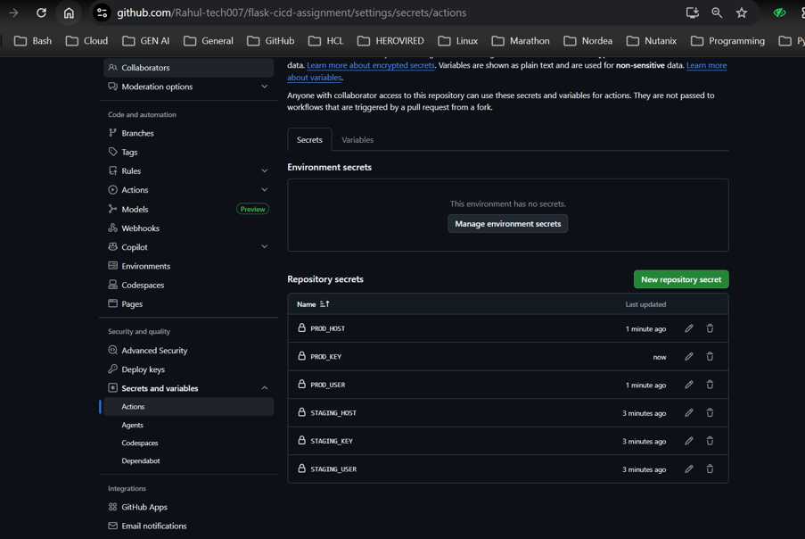

# Flask Application CI/CD using Jenkins and GitHub Actions

## Project Overview

This project demonstrates a complete Continuous Integration and Continuous Deployment (CI/CD) pipeline for a Flask application using **Jenkins** and **GitHub Actions**.

The project automates:

- Installing application dependencies
- Running automated unit tests using PyTest
- Building the application
- Deploying to a staging environment
- Deploying to a production environment using Git tags
- Securing deployment credentials using GitHub Secrets

---

# Project Objectives

This project was developed to demonstrate:

- Jenkins Pipeline
- GitHub Actions Workflow
- Continuous Integration (CI)
- Continuous Deployment (CD)
- Automated Testing
- GitHub Webhooks
- GitHub Secrets
- Branch Based Deployment
- Tag Based Production Deployment

---

# Technologies Used

| Technology | Version |
|------------|----------|
| Python | 3.12 |
| Flask | Latest |
| PyTest | Latest |
| Jenkins | Latest LTS |
| GitHub Actions | Latest |
| Git | Latest |
| Ubuntu GitHub Runner | ubuntu-latest |

---

# Repository Structure

```
flask-cicd-assignment
│
├── .github
│   └── workflows
│       └── ci-cd.yml
│
├── Jenkinsfile
├── app.py
├── test_app.py
├── requirements.txt
├── README.md
└── screenshots/
```

---

# Prerequisites

Before running the project ensure the following are installed.

- Python 3.12
- pip
- Git
- Jenkins
- GitHub Account
- GitHub Repository
- PyTest

---

# Jenkins CI/CD Pipeline

The Jenkins pipeline automates the application build, testing and deployment.

## Stage 1 – Checkout

Source code is pulled from the GitHub repository.

```
GitHub Repository
        │
        ▼
Jenkins Checkout
```

---

## Stage 2 – Build

Jenkins installs all required Python packages.

Command executed:

```bash
pip install -r requirements.txt
```

---

## Stage 3 – Test

The application is tested using PyTest.

Command:

```bash
pytest
```

Expected Output

```
Tests Passed
```

---

## Stage 4 – Deploy

If all tests pass, Jenkins deploys the Flask application.

Deployment Output

```
Deploying Flask Application...
Deployment Successful
```

---

# Jenkins Pipeline Flow

```
GitHub Push
      │
      ▼
Webhook Trigger
      │
      ▼
Checkout Code
      │
      ▼
Install Dependencies
      │
      ▼
Run Tests
      │
      ▼
Build
      │
      ▼
Deploy
```

---

# GitHub Webhook

Whenever code is pushed to the **main** branch:

GitHub

↓

Webhook

↓

Jenkins Job

↓

Pipeline Execution

---

# GitHub Actions Workflow

The GitHub Actions workflow automates CI/CD directly from GitHub.

Workflow file

```
.github/workflows/ci-cd.yml
```

---

## Trigger

```yaml
on:
  push:
    branches:
      - main
      - staging
    tags:
      - 'v*'
```

---

# Workflow Stages

## Job 1 – Test & Build

The workflow performs:

- Checkout repository
- Setup Python
- Install Dependencies
- Run Tests
- Build Application

---

## Job 2 – Deploy to Staging

Trigger

```
Push to staging branch
```

Action

```
Deploy to Staging
```

---

## Job 3 – Deploy to Production

Trigger

```
Git Tag (v1.3)
```

Action

```
Deploy to Production
```

---

# GitHub Secrets

Sensitive deployment information is stored securely using GitHub Repository Secrets.

| Secret | Purpose |
|---------|----------|
| STAGING_HOST | Staging Server Address |
| STAGING_USER | Staging Username |
| STAGING_KEY | SSH Private Key |
| PROD_HOST | Production Server Address |
| PROD_USER | Production Username |
| PROD_KEY | SSH Private Key |

No credentials are stored inside the repository.

---

# Branch Strategy

Main Branch

```
Production Ready Code
```

Staging Branch

```
Testing and Staging Deployment
```

Production

```
Git Tags
Example:
v1.3
```

---

# Automated Testing

Testing framework used

```
PyTest
```

Run manually

```bash
pytest
```

Expected Result

```
All Tests Passed
```

---

# Deployment Strategy

## Staging Deployment

Triggered automatically when code is pushed to:

```
staging
```

---

## Production Deployment

Triggered automatically when a Git tag is pushed.

Example

```bash
git tag v1.3
git push origin v1.3
```

---

# GitHub Actions Flow

```
Push to Main
      │
      ▼
Install Dependencies
      │
      ▼
Run Tests
      │
      ▼
Build
```

For Staging

```
Push to Staging
      │
      ▼
Deploy to Staging
```

For Production

```
Create Git Tag
      │
      ▼
Deploy to Production
```

---

# Jenkins Screenshots

Add the following screenshots inside:

```
screenshots/
```

Example

```
screenshots/
│
├── jenkins-dashboard.png
├── pipeline-success.png
├── console-output.png
├── build-stage.png
├── deploy-stage.png
```

Example in README

```markdown
## Jenkins Dashboard



## Successful Pipeline


```

---

# GitHub Actions Screenshots

```
screenshots/github-actions-success.png
screenshots/staging-deployment.png
screenshots/production-deployment.png
screenshots/github-secrets.png
```

Example

```markdown
## GitHub Actions Workflow


## Staging Deployment



## Production Deployment


```

---

# Jenkinsfile

The Jenkins pipeline performs

- Checkout
- Install Dependencies
- Run Tests
- Build
- Deploy

---

# GitHub Workflow

The GitHub workflow performs

- Checkout
- Setup Python
- Install Dependencies
- Run Tests
- Build
- Deploy to Staging
- Deploy to Production

---

# Future Improvements

- Docker Container Deployment
- Kubernetes Deployment
- SonarQube Integration
- Trivy Image Scanning
- Slack Notifications
- Email Notifications
- AWS EC2 Deployment

---

# Author

Rahul Bansal

GitHub

https://github.com/Rahul-tech007

Repository

# GitHub Secrets

## Overview

GitHub Secrets provide a secure mechanism to store sensitive information such as server credentials, SSH private keys, API tokens, and deployment credentials. Secrets are encrypted by GitHub and are only accessible during workflow execution.

This project uses GitHub Secrets to simulate secure deployment to staging and production environments without exposing sensitive information in the source code.

> **Note:** No credentials are hardcoded in this repository. All deployment-related information is stored securely using GitHub Repository Secrets.

---

# Configured Secrets

The following repository secrets have been configured under:

```
Repository
→ Settings
→ Secrets and variables
→ Actions
```

| Secret Name | Description | Used For |
|-------------|-------------|----------|
| STAGING_HOST | Hostname or IP address of the staging server | Staging deployment |
| STAGING_USER | SSH username for the staging server | Staging deployment |
| STAGING_KEY | SSH private key used to authenticate with the staging server | Secure staging deployment |
| PROD_HOST | Hostname or IP address of the production server | Production deployment |
| PROD_USER | SSH username for the production server | Production deployment |
| PROD_KEY | SSH private key used to authenticate with the production server | Secure production deployment |

---

# Why GitHub Secrets are Required

Using GitHub Secrets provides several advantages:

- Prevents sensitive credentials from being exposed in the source code.
- Ensures secure authentication during automated deployments.
- Protects SSH keys and server credentials.
- Enables safe collaboration without sharing confidential information.
- Follows DevSecOps best practices for CI/CD pipelines.

---

# Workflow Integration

The GitHub Actions workflow accesses these secrets during deployment.

Example:

```yaml
env:
  STAGING_HOST: ${{ secrets.STAGING_HOST }}
  STAGING_USER: ${{ secrets.STAGING_USER }}
```

Similarly, production deployment accesses:

```yaml
env:
  PROD_HOST: ${{ secrets.PROD_HOST }}
  PROD_USER: ${{ secrets.PROD_USER }}
```

---

# Deployment Process

## Staging Deployment

When code is pushed to the **staging** branch:

1. GitHub Actions starts the workflow.
2. The application is built and tested.
3. GitHub retrieves the staging secrets securely.
4. The deployment job uses the stored credentials to connect to the staging environment.
5. The application is deployed successfully.

---

## Production Deployment

When a Git tag (for example **v1.3**) is pushed:

1. GitHub Actions starts the production workflow.
2. The application is tested again.
3. Production secrets are retrieved securely.
4. The deployment job authenticates using the production SSH key.
5. The application is deployed to the production environment.

---

# Security Best Practices

This project follows these security practices:

- No passwords or private keys are stored in the repository.
- Sensitive information is encrypted using GitHub Secrets.
- Secrets are available only during workflow execution.
- Repository contributors cannot view secret values after they are created.
- Secret values remain hidden in workflow logs unless explicitly exposed.

---

# Repository Secrets Screenshot

The following screenshot shows the configured repository secrets.

```
screenshots/github-secrets.png
```

```markdown

```

---

# Summary

GitHub Secrets enable secure and automated deployments by protecting sensitive credentials while allowing GitHub Actions workflows to authenticate with staging and production environments. This approach follows industry-standard CI/CD security practices and eliminates the need to store confidential information within the project source code.

https://github.com/Rahul-tech007/flask-cicd-assignment
